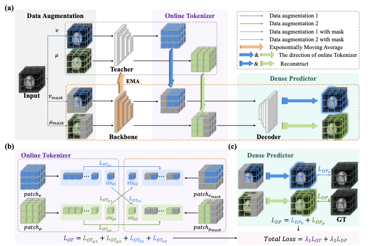
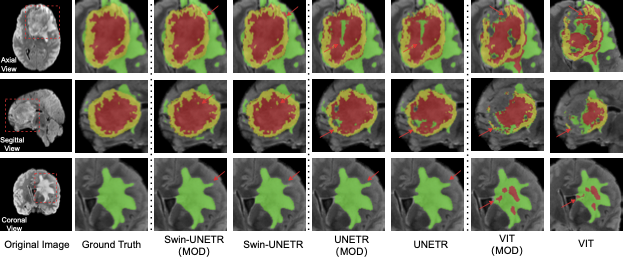

# MOD: Online Self-distillation and Self-modeling for 3D Brain Tumor Segmentation

> 🎉 This work is accepted by [IEEE Journal of Biomedical and Health Informatics](https://ieeexplore.ieee.org/document/10843341)

# Network Architecture



# Data Description

Dataset Name: BraTS2021

Modality: MRI

Size: 1470 3D volumes (1251 Training + 219 Validation)

Challenge: RSNA-ASNR-MICCAI Brain Tumor Segmentation (BraTS) Challenge

- Register and download the official BraTS 21 dataset from the link below and place then into "TrainingData" in the dataset folder:

  <https://www.synapse.org/#!Synapse:syn27046444/wiki/616992>

  For example, the address of a single file is as follows:

  "TrainingData/BraTS2021_01146/BraTS2021_01146_flair.nii.gz"

- Download the json file from this [link](https://drive.google.com/file/d/1i-BXYe-wZ8R9Vp3GXoajGyqaJ65Jybg1/view?usp=sharing) and placed in the same folder as the dataset.

The sub-regions considered for evaluation in BraTS 21 challenge are the "enhancing tumor" (ET), the "tumor core" (TC), and the "whole tumor" (WT). The ET is described by areas that show hyper-intensity in T1Gd when compared to T1, but also when compared to “healthy” white matter in T1Gd. The TC describes the bulk of the tumor, which is what is typically resected. The TC entails the ET, as well as the necrotic (NCR) parts of the tumor. The appearance of NCR is typically hypo-intense in T1-Gd when compared to T1. The WT describes the complete extent of the disease, as it entails the TC and the peritumoral edematous/invaded tissue (ED), which is typically depicted by hyper-intense signal in FLAIR [[BraTS 21]](http://braintumorsegmentation.org/).

# Visualization



# Training

## Install Environment
```bash
pip install -r requirements.txt
```


## Training Script
The ```mod-config.yml``` is the global parameters control file. Dataset loading and related parameter selection are controlled through the three bool variables of ```is_brats2021```, ```is_brats2019``` in ```mod-config.yml```.


Train UNETR
```bash
accelecate launch mod_unetr.py
```

Train ViT
```bash
accelecate launch mod_vit.py
```

# Bixtex
```bib
@article{pang2025online,
  title={Online Self-distillation and Self-modeling for 3D Brain Tumor Segmentation},
  author={Pang, Yan and Li, Yunhao and Huang, Teng and Liang, Jiaming and Wang, Zhen and Dong, Changyu and Kuang, Dongyang and Hu, Ying and Chen, Hao and Lei, Tim and others},
  journal={IEEE Journal of Biomedical and Health Informatics},
  year={2025},
  publisher={IEEE}
}
```